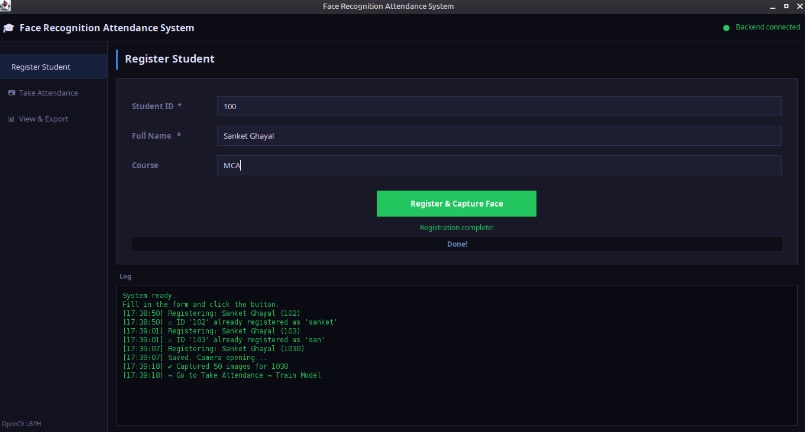
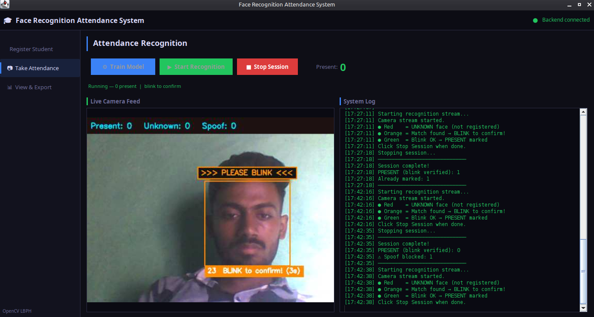
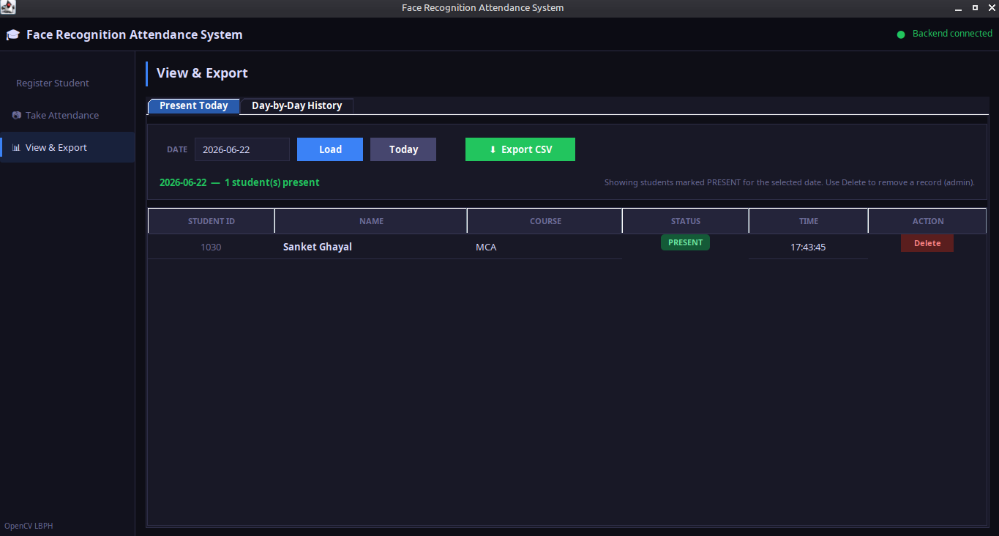

# 🎓 Face Recognition Attendance System

> Automatic attendance marking using Face Recognition + Blink Liveness Anti-Spoofing  
> Built for **Linux Mint 22.3** | No TensorFlow | No dlib | Pure OpenCV LBPH

---

## 📸 Screenshots

### Register Student


### Take Attendance


### View & Export


---

## ✨ Features

- 👤 **Face Registration** — Captures 50 photos with head movement guidance
- 🎯 **LBPH Recognition** — Fast and accurate face recognition using OpenCV
- 👁️ **Blink Anti-Spoof** — Rejects photos and phone screens (must blink to confirm)
- 📊 **Live Camera Feed** — Streams directly inside the Java UI (no separate window)
- 🗓️ **Daily Attendance** — View present/absent for any date
- 📈 **30-Day History** — Summary of last 30 days attendance
- 📤 **CSV Export** — Export attendance records to CSV file
- 🔒 **Duplicate Protection** — Same student cannot be marked twice in one day

---

## 🛠️ Tech Stack

| Layer | Technology |
|-------|-----------|
| Frontend | Java Swing |
| Backend | Python Flask |
| Face Recognition | OpenCV LBPH |
| Database | MySQL |
| Anti-Spoof | Blink Detection (Eye Cascade + Brightness) |
| Streaming | MJPEG over HTTP |

---

## ⚙️ How It Works

```
🔴 Red box    = Unknown face (not registered)
🟠 Orange box = Face matched → BLINK within 6 seconds to confirm
🟢 Green box  = Blink detected → PRESENT marked in database
⚠️  No blink  = SPOOF REJECTED (blocks photos and phone screens)
```

---

## 🚀 Installation

### Requirements
- Linux Mint 22.3 (or Ubuntu based)
- Python 3.x
- Java JDK 11+
- MySQL

### First Time Setup

```bash
# Clone the repository
git clone https://github.com/sanket-ghayal/face-attendance-system.git

# Go into project folder
cd face-attendance-system

# Run installer
bash install.sh
```

---

## ▶️ Running the Project

Open **2 terminals** and run:

**Terminal 1 — Start Backend:**
```bash
bash start_backend.sh
```

**Terminal 2 — Start Frontend:**
```bash
bash start_frontend.sh
```

---

## 📖 How to Use

### 1️⃣ Register Student
- Go to **Register Student** tab
- Enter Student ID, Name, Course
- Click **Register & Capture Face**
- Camera opens — capture 50 photos while moving head left/right/up
- Press **Q** when done

### 2️⃣ Take Attendance
- Go to **Take Attendance** tab
- Click **Train Model** (do this after registering all students)
- Click **Start Recognition**
- Live camera feed appears inside the app
- Students blink to confirm attendance
- Click **Stop Session** when done

### 3️⃣ View & Export
- Go to **View & Export** tab
- Pick any date to see attendance
- View **Day-by-Day History** (last 30 days)
- Click **Export CSV** to save records

---

## 📁 Project Structure

```
face_attendance_system/
├── install.sh
├── start_backend.sh
├── start_frontend.sh
├── schema.sql
├── python_backend/
│   ├── app.py
│   ├── database/
│   │   └── db.py
│   ├── services/
│   │   ├── attendance_service.py
│   │   ├── face_service.py
│   │   └── face_stream.py
│   └── routes/
│       ├── student_routes.py
│       ├── attendance_routes.py
│       └── recognition_routes.py
└── java_frontend/
    └── src/main/java/com/attendance/
        ├── Main.java
        ├── api/ApiClient.java
        ├── ui/
        │   ├── Theme.java
        │   ├── MainFrame.java
        │   ├── RegisterPanel.java
        │   ├── AttendancePanel.java
        │   └── RecordsPanel.java
        └── utils/CsvExporter.java
```

---

## 🔧 Troubleshooting

**Camera shows black / Cannot open camera:**
```bash
ls /dev/video*
sudo usermod -a -G video $USER
# Then log out and log back in
```

**DB error on backend startup:**
```bash
sudo systemctl start mysql
# Check python_backend/database/db.py credentials
```

**Recognition always says UNKNOWN:**
- Re-register with better lighting
- Make sure face is well-lit with no backlight
- Click Train Model again after re-capturing

**Blink not detected / always spoof:**
- Make sure both eyes are clearly visible
- Blink naturally and fully
- Increase `SPOOF_TIMEOUT_SEC` in `face_stream.py` if needed

---

## 👨‍💻 Developer

**Sanket Ghayal**  
GitHub: [@sanket-ghayal](https://github.com/sanket-ghayal)

---

## 📄 License

This project is open source and available under the [MIT License](LICENSE).
